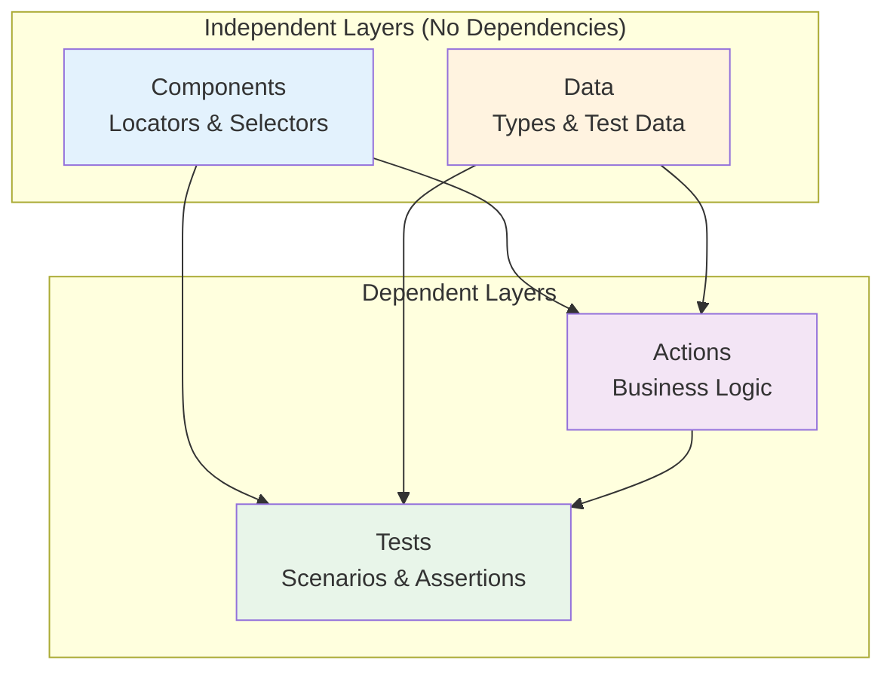

# CDAT Architecture

> Components-Data-Actions-Tests: A 4-layer architecture for maintainable E2E tests

## Overview

CDAT Pattern organizes test code into four distinct layers, each with a single responsibility:



## Dependency Rules

```
Components → nothing
Data       → nothing
Actions    → Components + Data
Tests      → Components + Data + Actions
```

**Key principle:** Lower layers never depend on higher layers.

---

## Layer Details

### Components Layer (`components.ts`)

Contains **only** locators and selectors. No logic, no assertions, no waits.

```typescript
import type { Page, Locator } from '@playwright/test';

export class LoginComponents {
  readonly usernameInput: Locator;
  readonly passwordInput: Locator;
  readonly submitButton: Locator;
  readonly errorMessage: Locator;

  constructor(private readonly page: Page) {
    this.usernameInput = page.getByLabel('Username');
    this.passwordInput = page.getByLabel('Password');
    this.submitButton = page.getByRole('button', { name: 'Sign in' });
    this.errorMessage = page.locator('[data-testid="error"]');
  }

  // Composed selectors (Selector Composition Pattern)
  getFieldError(fieldName: string): Locator {
    return this.page.locator(`[data-testid="${fieldName}-error"]`);
  }
}
```

**Rules:**
- Use `readonly` for all locators
- Use semantic locators (`getByRole`, `getByLabel`) when possible
- Group related selectors logically
- No business logic or waits

---

### Data Layer (`data.ts`)

Contains types, interfaces, enums, and test data. No locators, no logic.

```typescript
// Interfaces
export interface LoginCredentials {
  username: string;
  password: string;
  rememberMe?: boolean;
}

// Enums
export enum LoginErrorType {
  InvalidCredentials = 'Invalid username or password',
  AccountLocked = 'Account is locked',
}

// Test Data
export const VALID_USER: LoginCredentials = {
  username: 'testuser',
  password: 'Password123!',
};

export const INVALID_USER: LoginCredentials = {
  username: 'wrong',
  password: 'wrong',
};

// URLs
export const LOGIN_URLS = {
  login: '/login',
  dashboard: '/dashboard',
} as const;
```

**Rules:**
- Define interfaces for all data structures
- Use enums for fixed sets of values
- Group related constants together
- No locators or business logic

---

### Actions Layer (`actions.ts`)

Contains business logic and user interactions. **NO assertions** (`expect()` calls).

```typescript
import type { Page } from '@playwright/test';
import { Cdat, LocatorState } from '../utils/Cdat';
import { LoginComponents } from './components';
import type { LoginCredentials } from './data';

export class LoginActions {
  private readonly components: LoginComponents;

  constructor(private readonly page: Page) {
    this.components = new LoginComponents(page);
  }

  // Atomic actions (single responsibility)
  async fillUsername(username: string): Promise<void> {
    await Cdat.waitAndFill(this.components.usernameInput, username);
  }

  async fillPassword(password: string): Promise<void> {
    await Cdat.waitAndFill(this.components.passwordInput, password);
  }

  async clickSubmit(): Promise<void> {
    await Cdat.waitAndClick(this.components.submitButton);
  }

  // Composed action (Method Composition Pattern)
  async login(credentials: LoginCredentials): Promise<void> {
    await this.fillUsername(credentials.username);
    await this.fillPassword(credentials.password);
    await this.clickSubmit();
  }

  // State getters (return data, don't assert)
  async getErrorMessage(): Promise<string> {
    return Cdat.waitForText(this.components.errorMessage);
  }

  async isErrorDisplayed(): Promise<boolean> {
    return Cdat.checkState(
      this.components.errorMessage,
      LocatorState.Visible
    );
  }
}
```

**Rules:**
- Use smart waits (Cdat utility)
- NO `expect()` calls - assertions belong in tests
- Return data from state getters, don't assert
- Compose atomic actions into higher-level flows

---

### Tests Layer (`test.ts`)

Contains test scenarios with assertions. Uses Arrange-Act-Assert or Given-When-Then.

```typescript
import { test, expect } from '@playwright/test';
import { LoginActions } from './actions';
import { LoginComponents } from './components';
import { VALID_USER, INVALID_USER, LOGIN_URLS, LoginErrorType } from './data';

test.describe('Login Feature', () => {
  let actions: LoginActions;
  let components: LoginComponents;

  test.beforeEach(async ({ page }) => {
    actions = new LoginActions(page);
    components = new LoginComponents(page);
    await page.goto(LOGIN_URLS.login);
  });

  test('TC_001: Given valid credentials, When login, Then dashboard shown', async ({
    page,
  }) => {
    // Arrange (Given)
    const credentials = VALID_USER;

    // Act (When)
    await actions.login(credentials);

    // Assert (Then)
    await expect(page).toHaveURL(new RegExp(LOGIN_URLS.dashboard));
  });

  test('TC_002: Given invalid credentials, When login, Then error shown', async () => {
    // Arrange
    const credentials = INVALID_USER;

    // Act
    await actions.login(credentials);

    // Assert
    const errorMessage = await actions.getErrorMessage();
    expect(errorMessage).toContain(LoginErrorType.InvalidCredentials);
  });
});
```

**Rules:**
- All `expect()` assertions go here
- Use descriptive test names (Given-When-Then format)
- Follow Arrange-Act-Assert structure
- Direct access to components for visibility assertions

---

## File Structure

```
features/
├── login/
│   ├── components.ts    # C - Locators
│   ├── data.ts          # D - Types & test data
│   ├── actions.ts       # A - Business logic
│   └── test.ts          # T - Test scenarios
├── cart/
│   ├── components.ts
│   ├── data.ts
│   ├── actions.ts
│   └── test.ts
└── checkout/
    ├── components.ts
    ├── data.ts
    ├── actions.ts
    └── test.ts
```

This is **Vertical Slice Architecture** - organized by feature, not by layer.

---

## Composition Patterns

### Selector Composition

Compose locators to simulate user flow and keep selectors DRY:

```typescript
// components.ts
export class CheckoutComponents {
  // Base selector
  readonly form = this.page.locator('[data-testid="checkout-form"]');

  // Composed selectors (scoped to form)
  readonly emailField = this.form.locator('[data-testid="email"]');
  readonly addressField = this.form.locator('[data-testid="address"]');
  readonly submitButton = this.form.locator('button[type="submit"]');
}
```

### Method Composition

Compose actions to represent real user flows:

```typescript
// actions.ts
export class CheckoutActions {
  // Atomic actions
  async fillEmail(email: string) { ... }
  async fillAddress(address: Address) { ... }
  async selectPayment(method: PaymentMethod) { ... }
  async submitForm() { ... }

  // Composed actions (DRY)
  async completeCheckoutAsGuest(data: GuestCheckoutData) {
    await this.fillEmail(data.email);
    await this.fillAddress(data.address);
    await this.selectPayment(data.payment);
    await this.submitForm();
  }
}
```

---

## Best Practices

1. **Keep layers pure** - don't mix responsibilities
2. **Use vertical slices** - organize by feature
3. **Compose, don't duplicate** - build complex flows from simple actions
4. **Type everything** - no `any` types
5. **Smart waits only** - no `waitForTimeout`

---

## Next Steps

- Learn the [Three Zero Rules](./ZERO-RULES.md)
- Understand [Composition Patterns](./COMPOSITION.md)
- Explore [Smart Waits](./SMART-WAITS.md)
