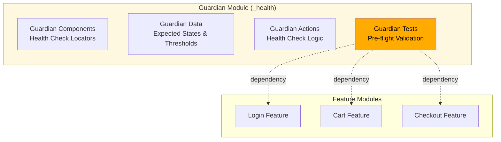
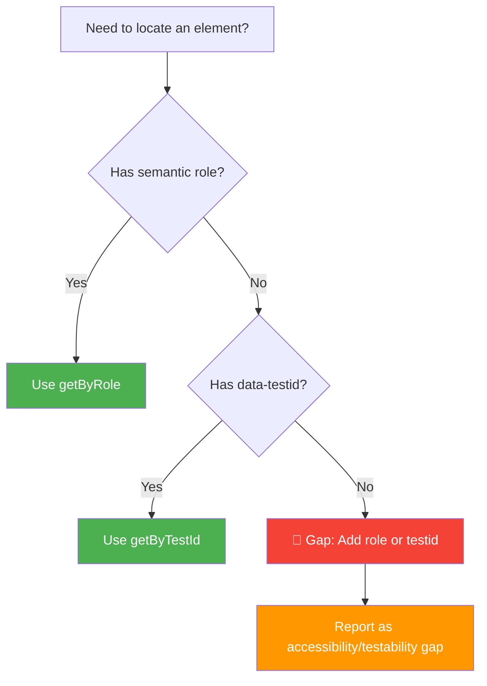

# Cross-Cutting Guardians

> Environment Health, i18n, and Accessibility concerns that enhance the core CDAT pattern

## Overview

While the core CDAT pattern (Components-Data-Actions-Tests) handles feature-specific testing beautifully, real-world applications have **cross-cutting concerns** that span all features:

- **Environment Health** - Is the backend up? Are translations loaded?
- **i18n (Internationalization)** - Are texts properly translated across locales?
- **Accessibility** - Can users with disabilities interact with the interface?

Cross-Cutting Guardians extend CDAT to handle these concerns **without breaking** the 4-layer architecture or the Three Zero Rules.

---

## The Guardian Pattern

A **Guardian** is a specialized CDAT module that:

1. **Follows full CDAT architecture** - has its own Components/Data/Actions/Tests layers
2. **Runs as pre-flight checks** - executed before feature tests to ensure environment stability
3. **Provides clear failure signals** - distinguishes infrastructure issues from feature bugs
4. **Maintains the Three Zero Rules** - no `any`, no `waitForTimeout`, no `else`



---

## Locator Policy: ARIA First, Text Never

### The Fundamental Rule

**Locate EXCLUSIVELY by ARIA roles and data-testid. NEVER by translated/visible text.**

```typescript
// ✅ GOOD - Durable locators
page.getByRole('button', { name: 'Submit' })     // ARIA role + accessible name
page.getByTestId('checkout-form')                // data-testid
page.getByLabel('Email address')                 // ARIA label

// ❌ BAD - Brittle text locators
page.getByText('Submit')                         // Breaks on translation
page.locator('text=Zatwierdzisz')               // Breaks on i18n change
page.locator('button:has-text("Submit")')       // Text-dependent
```

### Why This Policy Exists

| Problem | Text Locators | ARIA/TestID Locators |
|---------|---------------|---------------------|
| **i18n Coupling** | i18n fails → test fails on locator | i18n fails → test fails on assertion (correct) |
| **CDAT Dependencies** | components.ts needs data.ts for labels | components.ts stays pure (no dependencies) |
| **Maintenance** | Every translation change breaks tests | Translation changes only affect assertions |
| **Accessibility** | Ignores screen reader experience | Enforces accessible markup |

### Locator Decision Tree



---

## Guardian Implementation: _health Module

### File Structure

```
features/
├── _health/                    # Guardian module
│   ├── components.ts          # Health check locators
│   ├── data.ts               # Expected states, thresholds
│   ├── actions.ts            # Health check logic
│   └── test.ts               # Pre-flight tests
├── login/
│   └── ...
└── cart/
    └── ...
```

### 1. Guardian Components (`_health/components.ts`)

```typescript
import type { Page, Locator } from '@playwright/test';

export class HealthComponents {
  // Critical navigation elements
  readonly mainNavigation: Locator;
  readonly userMenuTrigger: Locator;
  readonly searchForm: Locator;
  
  // Error/loading indicators
  readonly errorBanner: Locator;
  readonly loadingSpinner: Locator;
  readonly offlineIndicator: Locator;
  
  // i18n health indicators
  readonly pageTitle: Locator;
  readonly primaryHeading: Locator;
  
  constructor(private readonly page: Page) {
    // ARIA-first locators only
    this.mainNavigation = page.getByRole('navigation', { name: 'Main menu' });
    this.userMenuTrigger = page.getByRole('button', { name: 'User menu' });
    this.searchForm = page.getByRole('search');
    
    // Error states
    this.errorBanner = page.getByTestId('error-banner');
    this.loadingSpinner = page.getByTestId('loading-spinner');
    this.offlineIndicator = page.getByTestId('offline-indicator');
    
    // Content elements for i18n validation
    this.pageTitle = page.locator('title');
    this.primaryHeading = page.getByRole('heading', { level: 1 });
  }
  
  // Dynamic locators for i18n validation
  getTranslationKeyElements(): Locator {
    // Find visible raw translation keys (e.g., "nav.home", "button.submit")
    return this.page.locator('text=/\\b\\w+\\.\\w+\\b/');
  }
}
```

### 2. Guardian Data (`_health/data.ts`)

```typescript
// Health check thresholds
export const HEALTH_THRESHOLDS = {
  maxResponseTime: 5000,      // API response time (ms)
  minNavigationElements: 3,   // Critical nav items
  maxRawI18nKeys: 0,         // Visible translation keys
} as const;

// Critical routes to validate
export const CRITICAL_ROUTES = [
  '/',           // Homepage
  '/login',      // Authentication
  '/search',     // Search functionality
] as const;

// Expected accessibility states
export interface AccessibilityExpectation {
  role: string;
  hasAccessibleName: boolean;
  isKeyboardAccessible: boolean;
}

export const CRITICAL_A11Y_ELEMENTS: AccessibilityExpectation[] = [
  { role: 'navigation', hasAccessibleName: true, isKeyboardAccessible: true },
  { role: 'search', hasAccessibleName: true, isKeyboardAccessible: true },
  { role: 'button', hasAccessibleName: true, isKeyboardAccessible: true },
];

// i18n validation patterns
export const I18N_PATTERNS = {
  // Raw translation keys that shouldn't be visible
  rawKey: /\b\w+\.\w+\b/,
  // Expected translated content patterns
  validText: /^[\w\s\-.,!?]+$/,
} as const;

// Health check results interface
export interface HealthCheckResult {
  status: 'healthy' | 'degraded' | 'unhealthy';
  checks: {
    backend: boolean;
    i18n: boolean;
    accessibility: boolean;
  };
  details: string[];
}
```

### 3. Guardian Actions (`_health/actions.ts`)

```typescript
import type { Page, Response } from '@playwright/test';
import { Cdat, LocatorState } from '../../utils/Cdat';
import { HealthComponents } from './components';
import { 
  HEALTH_THRESHOLDS, 
  CRITICAL_ROUTES, 
  CRITICAL_A11Y_ELEMENTS,
  I18N_PATTERNS,
  type HealthCheckResult,
  type AccessibilityExpectation 
} from './data';

export class HealthActions {
  private readonly components: HealthComponents;

  constructor(private readonly page: Page) {
    this.components = new HealthComponents(page);
  }

  // Backend Health Check
  async checkBackendHealth(): Promise<boolean> {
    for (const route of CRITICAL_ROUTES) {
      const startTime = Date.now();
      
      try {
        const response: Response = await this.page.goto(route);
        const responseTime = Date.now() - startTime;
        
        // Check: Non-5xx response
        if (!response.ok() && response.status() >= 500) {
          return false;
        }
        
        // Check: Response time within threshold
        if (responseTime > HEALTH_THRESHOLDS.maxResponseTime) {
          return false;
        }
        
      } catch {
        return false;
      }
    }
    
    return true;
  }

  // i18n Health Check
  async checkI18nHealth(): Promise<boolean> {
    // Navigate to homepage for i18n validation
    await this.page.goto('/');
    
    // Check 1: No visible raw translation keys
    const rawKeys = this.components.getTranslationKeyElements();
    const rawKeyCount = await rawKeys.count();
    
    if (rawKeyCount > HEALTH_THRESHOLDS.maxRawI18nKeys) {
      return false;
    }
    
    // Check 2: Critical elements have translated content
    const titleExists = await Cdat.checkState(
      this.components.pageTitle, 
      LocatorState.Attached
    );
    
    if (!titleExists) {
      return false;
    }
    
    const titleText = await Cdat.waitForText(this.components.pageTitle);
    
    // Title shouldn't be a raw translation key
    if (I18N_PATTERNS.rawKey.test(titleText)) {
      return false;
    }
    
    return true;
  }

  // Accessibility Health Check  
  async checkAccessibilityHealth(): Promise<boolean> {
    await this.page.goto('/');
    
    for (const expectation of CRITICAL_A11Y_ELEMENTS) {
      if (!await this.validateAccessibilityElement(expectation)) {
        return false;
      }
    }
    
    return true;
  }

  // Validate single accessibility element
  private async validateAccessibilityElement(
    expectation: AccessibilityExpectation
  ): Promise<boolean> {
    const elements = this.page.getByRole(expectation.role);
    const count = await elements.count();
    
    if (count === 0) {
      return false;
    }
    
    // Check first element (representative)
    const firstElement = elements.first();
    
    // Check: Has accessible name
    if (expectation.hasAccessibleName) {
      const accessibleName = await firstElement.getAttribute('aria-label') 
        || await firstElement.textContent();
      
      if (!accessibleName?.trim()) {
        return false;
      }
    }
    
    // Check: Keyboard accessible (focusable)
    if (expectation.isKeyboardAccessible) {
      const tabIndex = await firstElement.getAttribute('tabindex');
      const isFocusable = tabIndex !== '-1' && 
        await Cdat.checkState(firstElement, LocatorState.Visible);
      
      if (!isFocusable) {
        return false;
      }
    }
    
    return true;
  }

  // Comprehensive Health Check
  async performFullHealthCheck(): Promise<HealthCheckResult> {
    const checks = {
      backend: await this.checkBackendHealth(),
      i18n: await this.checkI18nHealth(),
      accessibility: await this.checkAccessibilityHealth(),
    };
    
    const healthyCount = Object.values(checks).filter(Boolean).length;
    const totalChecks = Object.keys(checks).length;
    
    let status: HealthCheckResult['status'];
    if (healthyCount === totalChecks) {
      status = 'healthy';
    } else if (healthyCount >= totalChecks / 2) {
      status = 'degraded';
    } else {
      status = 'unhealthy';
    }
    
    const details: string[] = [];
    if (!checks.backend) details.push('Backend connectivity issues');
    if (!checks.i18n) details.push('Translation loading problems');
    if (!checks.accessibility) details.push('Critical accessibility gaps');
    
    return { status, checks, details };
  }
}
```

### 4. Guardian Tests (`_health/test.ts`)

```typescript
import { test, expect } from '@playwright/test';
import { HealthActions } from './actions';

test.describe('Environment Health (Pre-flight)', () => {
  let healthActions: HealthActions;

  test.beforeEach(async ({ page }) => {
    healthActions = new HealthActions(page);
  });

  test('TC_HEALTH_001: Backend services are responsive', async () => {
    const isBackendHealthy = await healthActions.checkBackendHealth();
    
    expect(isBackendHealthy).toBe(true);
  });

  test('TC_HEALTH_002: i18n translations are loaded', async () => {
    const isI18nHealthy = await healthActions.checkI18nHealth();
    
    expect(isI18nHealthy).toBe(true);
  });

  test('TC_HEALTH_003: Critical elements have accessibility roles', async () => {
    const isA11yHealthy = await healthActions.checkAccessibilityHealth();
    
    expect(isA11yHealthy).toBe(true);
  });

  test('TC_HEALTH_FULL: Complete environment health check', async () => {
    const healthReport = await healthActions.performFullHealthCheck();
    
    expect(healthReport.status).toBe('healthy');
    expect(healthReport.checks.backend).toBe(true);
    expect(healthReport.checks.i18n).toBe(true);
    expect(healthReport.checks.accessibility).toBe(true);
  });
});
```

---

## Playwright Configuration

Configure Guardian tests as dependencies:

```typescript
// playwright.config.ts
import { defineConfig, devices } from '@playwright/test';

export default defineConfig({
  projects: [
    // Pre-flight health check
    {
      name: 'health-check',
      testDir: './features/_health',
      use: { ...devices['Desktop Chrome'] },
    },
    
    // Feature tests depend on health
    {
      name: 'chrome-features',
      testDir: './features',
      testIgnore: './features/_health/**',
      dependencies: ['health-check'], // Runs after health check passes
      use: { ...devices['Desktop Chrome'] },
    },
  ],
});
```

---

## Updated Layer Responsibilities

| Layer | Original CDAT | With Cross-Cutting Guardians |
|-------|---------------|-------------------------------|
| **Components** | Feature locators only | Feature locators + health check locators |
| **Data** | Feature types & test data | Feature data + health thresholds & expectations |
| **Actions** | Feature business logic | Feature logic + health validation logic |
| **Tests** | Feature scenarios | Feature tests + pre-flight guardian tests |

**Guardian Principle:** Cross-cutting concerns get their own CDAT modules but follow the same architectural rules.

---

## Migration Guide: From Text Locators to ARIA

### Step 1: Audit Current Locators

Find text-based locators in your codebase:

```bash
# Search for text-based locators
grep -r "getByText\|text=" features/
grep -r "has-text\|text-is" features/
```

### Step 2: Replace with ARIA Locators

```typescript
// Before: Text locator
const submitButton = page.getByText('Submit Order');

// After: ARIA locator
const submitButton = page.getByRole('button', { name: 'Submit Order' });
```

### Step 3: Add data-testid for Non-Semantic Elements

```typescript
// Before: CSS selector
const loader = page.locator('.spinner');

// After: Test ID
const loader = page.getByTestId('loading-spinner');
```

### Step 4: Move Text Validation to Tests

```typescript
// Before: Text in locator (components.ts)
readonly submitButton = page.getByText('Submit Order');

// After: ARIA in components, text assertion in tests
// components.ts
readonly submitButton = page.getByRole('button', { name: 'Submit Order' });

// test.ts
await expect(components.submitButton).toHaveText('Submit Order');
```

---

## Best Practices

### 1. Guardian Scope

**DO:** Test cross-cutting infrastructure concerns
```typescript
✅ Backend connectivity
✅ Translation loading
✅ Critical accessibility roles
✅ Authentication state persistence
```

**DON'T:** Test feature-specific logic
```typescript
❌ Shopping cart calculations
❌ Form validation rules  
❌ Business workflows
```

### 2. Failure Signal Clarity

Design Guardians to provide **clear failure context**:

```typescript
// ✅ GOOD - Clear signal
test('Backend health check failed: API returned 500 on /api/products');

// ❌ BAD - Confusing signal  
test('Product list test failed'); // Was it backend or feature logic?
```

### 3. Minimal Guardian Surface

Keep Guardian checks **fast and focused**:

```typescript
✅ Ping 3 critical endpoints (not 50)
✅ Check 5 key accessibility roles (not every element)  
✅ Validate core translations (not entire dictionary)
```

---

## Benefits

### 1. Faster Debugging
```
Traditional: "Test failed" → investigate feature logic → discover backend was down
With Guardians: "Health check failed: Backend connectivity" → fix infrastructure first
```

### 2. Stable Feature Tests
- i18n failures don't cascade to 50+ feature tests
- Backend outages are detected upfront, not buried in complex scenarios
- Accessibility gaps are caught before they affect specific features

### 3. Cross-Team Communication
- **Infra team:** Guardian failures indicate infrastructure issues
- **i18n team:** Translation health is explicitly validated
- **Accessibility team:** A11y compliance is continuously monitored
- **QA team:** Feature tests run against validated environments

### 4. CDAT Principles Preserved
- **Zero any:** All health check results are properly typed
- **Zero waitForTimeout:** Smart waits for health check elements
- **Zero else:** Early returns in health validation logic
- **4-layer architecture:** Guardians follow full CDAT structure
- **Dependency rules:** Components → nothing, Data → nothing, etc.

---

## Next Steps

1. **Implement Guardian** - Start with `_health` module in your project
2. **Configure Dependencies** - Set up Playwright projects with health checks first  
3. **Migrate Locators** - Replace text-based locators with ARIA/testid
4. **Expand Coverage** - Add more Guardian modules (auth, performance, etc.)

---

## See Also

- [CDAT Architecture](./ARCHITECTURE.md) - Core 4-layer pattern
- [Zero Rules](./ZERO-RULES.md) - The three zero rules
- [Smart Waits](./SMART-WAITS.md) - Cdat utility class
- [Basic Example with Health](../examples/basic/features/_health/) - Implementation reference