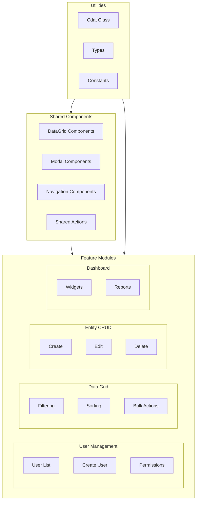

# CDAT Pattern - CRM/ERP Examples

> **Production-ready test patterns for Customer Relationship Management and Enterprise Resource Planning systems**

## 🎯 Overview

This directory contains comprehensive CRM/ERP testing patterns extracted from production systems and adapted to the CDAT (Components-Data-Actions-Tests) architecture. These examples demonstrate advanced patterns that go beyond typical e-commerce scenarios.

## 📊 What Makes CRM/ERP Different

| Pattern | CRM/ERP Focus | E-Commerce Focus |
|---------|---------------|------------------|
| **User Management** | Complex roles, permissions, departments | Simple customer accounts |
| **Data Grids** | Advanced filtering, bulk operations | Product catalogs |
| **Forms** | Multi-step, conditional, business rules | Checkout flows |
| **Documents** | Invoices, contracts, compliance | Orders, receipts |
| **Workflows** | Approval processes, state machines | Order fulfillment |

## 🏗️ Architecture

### CDAT Implementation



### Zero Rules Compliance

✅ **Zero `any`** - Strict TypeScript typing throughout
✅ **Zero `waitForTimeout`** - Intelligent waits with Cdat utility
✅ **Zero `else`** - Early return patterns for clean logic

## 📂 Directory Structure

```
examples/crm-erp/
├── utils/                           # Core utilities
│   ├── cdat.ts                     # Enhanced CDAT utility class
│   ├── types.ts                    # TypeScript interfaces & enums
│   └── constants.ts                # Timeouts, selectors, validation
│
├── shared/                         # Reusable components
│   ├── components/
│   │   ├── data-grid.ts           # Advanced data grid locators
│   │   ├── modal.ts               # Modal dialog components
│   │   └── navigation.ts          # Navigation components
│   └── actions/
│       ├── data-grid-actions.ts   # Grid interaction methods
│       ├── modal-actions.ts       # Modal interaction methods
│       └── navigation-actions.ts  # Navigation methods
│
├── features/                       # Feature-specific implementations
│   ├── user-management/
│   │   ├── user-list/             # User list with advanced filtering
│   │   ├── create-user/           # Multi-step user creation
│   │   └── user-permissions/      # Role and permission management
│   │
│   ├── data-grid/                 # Data grid patterns
│   │   ├── filtering/             # Advanced filtering examples
│   │   ├── sorting/               # Multi-column sorting
│   │   └── bulk-actions/          # Bulk operation patterns
│   │
│   ├── entity-crud/               # Generic CRUD operations
│   │   ├── create/                # Entity creation patterns
│   │   ├── edit/                  # Entity editing patterns
│   │   └── delete/                # Entity deletion patterns
│   │
│   └── dashboard/                 # Dashboard patterns
│       └── overview/              # Widget-based dashboard
│
├── package.json                   # Dependencies and scripts
├── playwright.config.ts           # Playwright configuration
├── tsconfig.json                  # TypeScript configuration
└── README.md                      # This file
```

## 🚀 Quick Start

### Prerequisites

- Node.js 16+ and npm
- Basic understanding of Playwright and TypeScript

### Installation

```bash
cd examples/crm-erp
npm install
npx playwright install
```

### Running Tests

```bash
# Run all CRM/ERP tests
npm run test

# Run specific feature tests
npm run test:user-management
npm run test:data-grid
npm run test:dashboard

# Run with UI mode for debugging
npm run test:ui

# Run in headed mode
npm run test:headed
```

### Development

```bash
# Run TypeScript compiler in watch mode
npx tsc --watch

# Run specific test file
npx playwright test features/user-management/user-list/test.ts

# Debug a specific test
npx playwright test --debug features/user-management/user-list/test.ts
```

## 🧩 Key Features Demonstrated

### 1. Advanced User Management

**Location:** `features/user-management/`

**Patterns Covered:**
- User list with multi-criteria filtering
- Multi-step user creation form
- Role-based permission management
- Bulk user operations (activate, deactivate, delete)

```typescript
// Example: Advanced user search and filtering
await userListActions.searchUsers('admin@example.com');
await userListActions.applyFilters({
  role: UserRole.Admin,
  status: UserStatus.Active,
  department: 'Engineering'
});
```

### 2. Production-Ready Data Grid

**Location:** `shared/components/data-grid.ts`

**Patterns Covered:**
- 6 filter types (TEXT, MULTISELECT, DATE_RANGE, SWITCH, NUMERIC_RANGE)
- Advanced sorting with multiple columns
- Pagination with configurable page sizes
- Column management (show/hide, reorder)
- Bulk operations with confirmation

```typescript
// Example: Complex data grid operations
const gridActions = new DataGridActions(page);
await gridActions.applyFilter({
  columnKey: 'status',
  filterType: FilterType.MULTISELECT,
  value: ['Active', 'Pending']
});
await gridActions.sortColumn({ columnKey: 'createdAt', direction: 'desc' });
await gridActions.performBulkOperation({
  actionName: 'activate',
  selectedRows: [0, 1, 2],
  requiresConfirmation: true
});
```

### 3. Complex Form Handling

**Location:** `features/user-management/create-user/`

**Patterns Covered:**
- Multi-step form wizard
- Conditional field validation
- Real-time password strength checking
- File upload handling
- Form state management (draft saving)

```typescript
// Example: Multi-step form completion
const createUserData = CreateUserDataFactory.createBasicUserData({
  role: UserRole.Manager,
  department: 'Engineering'
});
await createUserActions.completeAllSteps(createUserData);
```

### 4. Modal Dialog Management

**Location:** `shared/components/modal.ts`

**Patterns Covered:**
- Confirmation dialogs
- Form modals
- Multi-step modal workflows
- Loading states in modals
- Modal composition and reusability

### 5. Smart Utility Methods

**Location:** `utils/cdat.ts`

**Enhanced Features:**
- Intelligent element state waiting
- Grid-specific reload detection
- Form submission handling
- File upload utilities
- Navigation waiting with URL patterns

```typescript
// Example: Enhanced utility usage
await Cdat.waitAndFill(emailInput, 'user@example.com');
await Cdat.waitForGridReload(page, dataGrid);
await Cdat.uploadFile(fileInput, './test-file.pdf');
```

## 📋 Test Scenarios Covered

### User Management Tests (36 scenarios)

- ✅ User list loading and pagination
- ✅ Search functionality (email, name, partial matches)
- ✅ Advanced filtering (role, status, department, date range)
- ✅ Sorting (multiple columns, directions)
- ✅ Bulk operations (activate, deactivate, delete, export)
- ✅ Individual user actions (edit, view, delete)
- ✅ Form validation and error handling
- ✅ Multi-step user creation workflow

### Data Grid Tests (25 scenarios)

- ✅ Filter types (text, multiselect, date range, boolean)
- ✅ Column management (show/hide, reorder)
- ✅ Pagination (page sizes, navigation)
- ✅ Selection (single, multiple, all)
- ✅ Export functionality (CSV, Excel, PDF)
- ✅ Error handling and retry mechanisms

### Form Handling Tests (20 scenarios)

- ✅ Multi-step form navigation
- ✅ Field validation (real-time and on submit)
- ✅ Conditional field display
- ✅ File upload and preview
- ✅ Draft saving and restoration
- ✅ Form state management

## 🎨 Design Patterns Used

### 1. Component Composition

```typescript
// Shared data grid can be composed with feature-specific components
export class UserListComponents extends DataGridComponents {
  get userSpecificFilter(): Locator {
    return this.page.locator('[data-testid="user-role-filter"]');
  }
}
```

### 2. Action Composition

```typescript
// Actions build on shared functionality
export class UserListActions extends DataGridActions {
  async searchUsersByRole(role: UserRole): Promise<void> {
    await this.applyFilter({
      columnKey: 'role',
      filterType: FilterType.MULTISELECT,
      value: [role]
    });
  }
}
```

### 3. Factory Pattern for Test Data

```typescript
// Flexible test data creation
const adminUser = CreateUserDataFactory.createAdminUserData({
  department: 'IT',
  officeLocation: OfficeLocation.NewYork
});
```

### 4. Strategy Pattern for Validation

```typescript
// Different validation strategies for different contexts
const validationRules = {
  [FormStep.BasicInfo]: basicInfoValidation,
  [FormStep.RolePermissions]: rolePermissionValidation,
  [FormStep.AdditionalInfo]: additionalInfoValidation
};
```

## 🔧 Configuration

### TypeScript Configuration

Strict typing with enhanced checks:

```json
{
  "compilerOptions": {
    "strict": true,
    "noImplicitReturns": true,
    "noPropertyAccessFromIndexSignature": true,
    "exactOptionalPropertyTypes": true
  }
}
```

### Playwright Configuration

Production-ready settings:

```typescript
export default defineConfig({
  fullyParallel: true,
  retries: process.env.CI ? 2 : 0,
  reporter: 'html',
  use: {
    trace: 'on-first-retry',
    screenshot: 'only-on-failure'
  }
});
```

## 📊 Performance Considerations

### Optimized Waiting Strategies

```typescript
// Wait for specific states instead of timeouts
await Cdat.waitForState(element, LocatorState.Visible, timeout);

// Check states without throwing
const isVisible = await Cdat.checkState(element, LocatorState.Visible, shortTimeout);

// Wait for minimum element count
await Cdat.waitForMinimumCount(rows, 5, timeout);
```

### Efficient Element Selection

```typescript
// Use data attributes for reliable selection
private readonly USER_ROW = '[data-testid="user-row"]';

// Compose selectors for maintainability
getUserRowByEmail(email: string): Locator {
  return this.page.locator(`${this.USER_ROW}:has-text("${email}")`);
}
```

## 🧪 Testing Best Practices

### 1. Descriptive Test Names

```typescript
test('TC_UL_001.GivenUserListPage_WhenSearchingByEmail_ThenCorrectUserIsDisplayed')
```

### 2. Arrange-Act-Assert Pattern

```typescript
// Arrange
const searchQuery = TestUsers.adminActive.email;

// Act
await userListActions.searchUsers(searchQuery);

// Assert
expect(await userListActions.verifyUserExists(searchQuery)).toBeTruthy();
```

### 3. Independent Test Scenarios

```typescript
test.beforeEach(async ({ page }) => {
  userListActions = new UserListActions(page);
  await userListActions.navigateToUserList();
});
```

### 4. Comprehensive Error Handling

```typescript
test('GivenNoSelectedUsers_WhenAttemptingBulkOperation_ThenErrorMessageIsShown', async () => {
  await expect(async () => {
    await userListActions.performBulkOperation(BulkOperationType.Activate);
  }).rejects.toThrow();
});
```

## 🔄 Migration from Page Object Model

### Before (Classic POM)

```typescript
// Tightly coupled, hard to maintain
class UserPage {
  async createUser(userData) {
    await this.clickAddButton();
    await this.fillForm(userData);
    await this.clickSubmit();
    return this.getSuccessMessage();
  }
}
```

### After (CDAT Pattern)

```typescript
// Separated concerns, highly maintainable
class CreateUserActions {
  async completeUserCreation(data: CreateUserFormData): Promise<void> {
    await this.fillBasicInformation(data);
    await this.configureRolePermissions(data);
    await this.addAdditionalInformation(data);
    await this.confirmAndSubmit();
  }
}
```

## 📚 Learning Resources

### Understanding CDAT Architecture

1. Read the main CDAT documentation in `../../docs/`
2. Study the basic examples in `../basic/`
3. Compare with e-commerce examples in `../e-commerce/`

### Advanced Patterns

1. **Multi-step Forms**: `features/user-management/create-user/`
2. **Data Grid Mastery**: `shared/components/data-grid.ts`
3. **Modal Management**: `shared/components/modal.ts`
4. **Smart Utilities**: `utils/cdat.ts`

### Production Integration

1. **CI/CD Integration**: Use the provided `playwright.config.ts`
2. **Environment Management**: Extend `utils/constants.ts`
3. **Reporting**: Configure custom reporters in Playwright
4. **Parallel Execution**: Scale with `fullyParallel: true`

## 🤝 Contributing

### Adding New Features

1. Create feature directory: `features/my-feature/`
2. Implement CDAT structure: `components.ts`, `data.ts`, `actions.ts`, `test.ts`
3. Follow zero rules: no `any`, no `waitForTimeout`, no `else`
4. Add comprehensive test scenarios
5. Update this README

### Code Style Guidelines

- Use TypeScript strict mode
- Follow existing naming conventions
- Add JSDoc comments for public methods
- Write descriptive test names (Given-When-Then)
- Use data-testid attributes for element selection

## 📄 License

MIT License - See the main project LICENSE file.

## 🙋‍♂️ Support

- **Issues**: Report bugs and request features in the main CDAT Pattern repository
- **Discussions**: Join the community discussions for questions and ideas
- **Documentation**: Check the main docs folder for comprehensive guides

---

**Built with ❤️ using the CDAT Pattern**
*Production-ready test automation for the modern web*